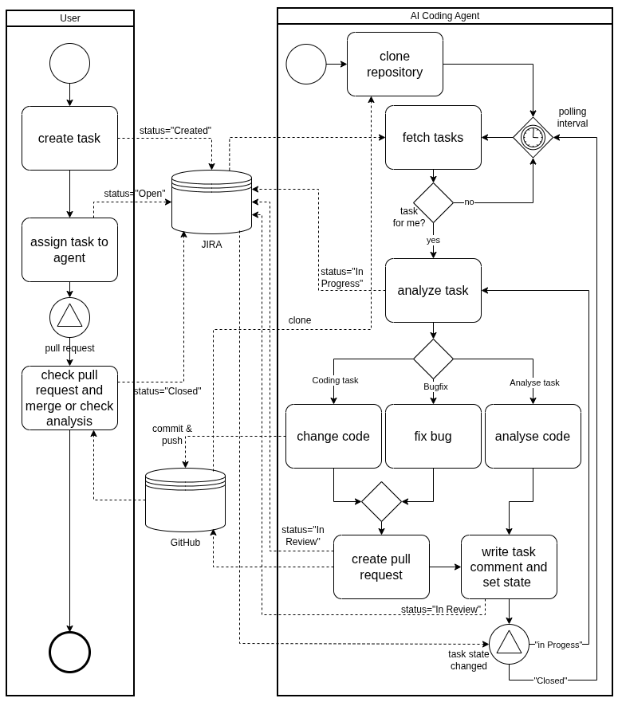

# Autonomous Containerized AI Coding Agent


This project demonstrates a POC for an autonomous, containerized AI coding agent that lives in your Docker environment. 
It operates completely unsupervised to:

- **Connect** to your task management system
- **Pick up** open tickets automatically
- **Analyze/Write** code or fix bugs
- **Push** changes via pull requests to GitHub

## Solve the Talent Bottleneck with Artificial Developers

Modern software is complex. It relies on the collaboration of specialized teams across backend, frontend, database, 
security, and more. Every developer is a vital link in the value chain.

But what happens when resources become a bottleneck? **The solution? Simply augment your team with artificial developers working autonomously—seamlessly integrated via Jira tickets and pull requests.**



## Key Features

As a **Proof of Concept (POC)**, the system demonstrates the following advanced capabilities:

- **Multi-Agent Architecture:** Uses **LangGraph** to route tasks to specialized sub-agents (`Coder`, `Bugfixer`, `Analyst`).
- **Autonomous Git Operations:** Manages the full Git lifecycle—cloning, branching, committing, pushing, and pull requests—using the **Model Context Protocol (MCP)**.
- **Task Management Integration:** Connects via REST API to external task/issue management systems (e.g. JIRA) to retrieve assignments and report status updates automatically.
- **Resilient AI Logic:** Features advanced **self-healing mechanisms** with retry loops and iterative prompting to prevent stalling and minimize hallucinations.
- **Dockerized & Scalable:** Runs in secure, isolated containers, allowing for effortless horizontal scaling—simply spin up additional instances to expand your virtual workforce on demand.

## Future Roadmap: From POC to Professional SaaS

This Proof of Concept serves as the technological foundation for an upcoming startup venture. The goal is to evolve the system into a commercial, fully managed SaaS platform that integrates seamlessly into enterprise workflows.

Key milestones for professionalization include:

- **Integrated Build Management & QA:** Implementation of industry-standard build tools (e.g., Maven, Gradle) directly within the agent's environment. Agents will compile code and execute local tests before committing, acting as a quality gate to ensure only functional, bug-free code enters the repository.
- **Active Code Reviews:** Agents will evolve from pure contributors to reviewers. They will analyze open Pull Requests, provide constructive feedback on code quality and security, and suggest optimizations—acting as an automated senior developer.
- **Collaborative Swarm Intelligence:** Moving beyond isolated tasks, agents will be capable of communicating and collaborating with each other. This "swarm" capability will allow multiple agents to work jointly on complex, large-scale features, ensuring architectural consistency across the codebase.

**Commercialization & Next Steps** To realize this vision, we are transitioning this project into a dedicated startup. We plan to accelerate development through an upcoming crowdfunding campaign.


## Architecture

The system is built upon a stateful, multi-agent architecture powered by LangGraph. Instead of a monolithic process, the execution flow is intelligently orchestrated across specialized nodes:

* **Router Node:** Acts as the entry point. It analyzes the incoming ticket context and determines the optimal execution strategy by selecting the appropriate specialist.

* **Specialist Nodes (Agents):**

👨‍💻 - Coder: Focuses on implementing new features and writing complex logic.

🐛 - Bugfixer: Diagnoses stack traces and applies targeted, minimal fixes to resolve errors.

🧐 - Analyst: Operates in read-only mode to perform code reviews, answer queries, or map out dependencies.

* **Hybrid Tool Execution:** The agents utilize a dual-layer toolset: the Model Context Protocol (MCP) for deep analysis and context retrieval, combined with Local Python execution for direct file I/O and Git operations.

* **Self-Correction Loop:** A dedicated control node monitors agent behavior. If an agent fails to execute a tool correctly or provides empty responses, this loop intervenes to force a retry and realign the workflow.

## Tech Stack

* **Core:** Python 3.11+
* **Orchestration:** [LangGraph](https://langchain-ai.github.io/langgraph/)
* **AI Model:** Mistral Large (`mistral-large-latest`) via LangChain
* **Protocol:** [Model Context Protocol (MCP)](https://modelcontextprotocol.io/) (Git Server)
* **Infrastructure:** Docker & UV (Package Manager)
* **Backend:** Flask, SQLAlchemy, APScheduler

---

## Getting Started

### Prerequisites

* **Docker** installed on your machine.
* A **Mistral AI API Key** (requires a subscription/credits).
* A **GitHub Personal Access Token** (Classic) with `repo` scope.
* A running Task Management API (or a mock server).

### 1. Build the Image

```bash
docker build -t coding-agent .
```

### 2. Run the Container
You must pass your API keys as environment variables.

```bash
docker run \
  -e MISTRAL_API_KEY="your_mistral_api_key" \
  -e GITHUB_TOKEN="your_github_pat" \
  -p 5000:5000 \
  -v $(pwd)/instance:/app/instance \
  coding-agent
```
